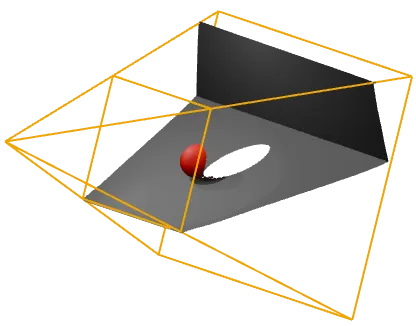
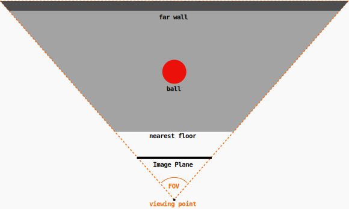
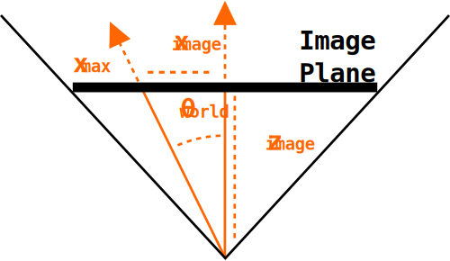
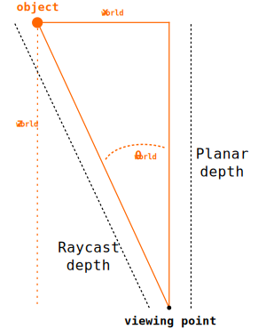

# DPT Depth Results

The DPT models output _inverse depth_ maps with (generally unknown) scaling and shift parameters. While this may seem strange, the justification is that it allows models to be trained on a wider variety of datasets which may otherwise have incompatible depth representations. The original explanation can be found in ["Towards Robust Monocular Depth Estimation"](https://arxiv.org/abs/1907.01341), under section 5: **Training on Diverse data**.

## Understanding Depth Representations

Consider the following image of a red ball with a floor/wall behind it, shown below along with the corresponding DPT colormapped result.

  

To help explain the difference between true depth, normalized depth, inverse depth and normalized inverse depth, we'll use an even more simplified 2D representation of the scene above.
In the image below, the top-left diagram shows the 'true depth' interpretation of the scene, where the eye/camera represents our viewing point and the distance to the closest (floor) and farthest (wall) points as well as the distance to the ball are shown. We assume that the farthest distance we see in the image is 5 meters away (a point on the wall) and the closest is 3 meters (a point on the floor), though these are just convenient made up numbers.

  

Notice that the value ordering of these points is reversed in the normalized inverse depth result (bottom-right), which corresponds to the DPT result. For example close parts of the image are shown in bright orange which correspond to values of 1.0 while far parts of the image are dark purple and correspond to values of 0.0. This is the idea behind 'inverse depth' which represents far points with smaller values.

We can write each of the representations in a more general form:

$$ \text{Normalized Depth} = \frac{d - d_{min}}{d_{max} - d_{min}} $$

$$ \text{Inverse Depth} = \frac{1}{d} $$

$$ \text{Normalized Inverse Depth} = \frac{d^{-1} - d_{max}^{-1}}{d_{min}^{-1} - d_{max}^{-1}} $$

Where d is the true depth and dmin, dmax are the minimum and maximum depth values, respectively.

**Note:** In practice, while the DPT models do output inverse depth (un-normalized), it is not usually scaled correctly to match the inverse of the true depth. Therefore, it seems to always make sense to normalize the DPT result both for display and calculations.

## True depth from DPT Result
Typically, we would want to go from the DPT result back to true depth. In the diagram above, we have formulas converting from true depth to inverse depth (top-left to bottom-left diagrams) and then to normalized inverse depth (bottom-left to bottom-right diagrams). We can reverse the process to derive a formula that maps the normalized inverse result (normalized DPT) back to true depth, assuming we know the minimum and maximum depth values:

$$\text{True Depth} = \left [ V_{norm} \left ( \frac{1}{d_{min}} - \frac{1}{d_{max}} \right ) + \frac{1}{d_{max}} \right ] ^{-1}$$

Here Vnorm corresponds to the normalized inverse depth result (which we get by normalizing the DPT result) and dmin and dmax correspond to the (known) minimum and maximum depth values (in this case, 3 and 5). For example, we know the normalized inverse depth of the ball is 0.375 and we expect this formula to give us the true depth of 4 meters:

$$\text{True Depth (ball)} = \left [ 0.375 \left ( \frac{1}{3} - \frac{1}{5} \right ) + \frac{1}{5} \right ] ^{-1} = \left [ 0.25 \right ] ^{-1} = 4$$

So that works as expected! But what about if you don't know the minimum and maximum (or any) true depth values? In that case, you're probably best off using something like [ZoeDepth](https://github.com/isl-org/ZoeDepth), which is an [extension on top of the DPT models](https://arxiv.org/abs/2302.12288) to handle metric depth (i.e. true depth).

However, if you don't care about getting exactly correct results and just want to 'un-distort' the inverse mapping, the formula above can be written as:

$$\text{True Depth} = \frac{1}{A \times V_{norm} + B}$$

With this form you can manually adjust the A and B values until the mapping looks plausible (this is how the [3D viewer](https://github.com/heyoeyo/muggled_dpt?tab=readme-ov-file#run-3d-viewer) works).

## Results are scene-specific!

It's important to note that the mapping between the DPT result and the true depth varies on a scene-by-scene (or image-by-image) basis! It is not fixed for a given camera and (in general) will not be stable over a video sequence. This can be seen by the fact that the mapping depends on the closest and farthest objects in the image, due to the dmin and dmax terms. Consider the example below, where we start with the same red ball scene as before, but then replace the small red ball with a larger (and closer) purple ball:

  

In particular, notice that the purple ball is now mapped to the closest normalized inverse value (i.e. 1.0) and the floor is mapped to a small inverse value (0.167), suggesting it's now far away. If we used the same minimum and maximum depth values as before, we would incorrectly estimate the ball to be 3 meters away, since that was the previous value of dmin and the floor would be estimated as being 4.5 meters away. In general, you can only reliably re-use the mapping if you know that the closest and farthest points are not changing between images.

## Field-of-view (FOV)

The examples above only consider a 2D depth-wise slice of a scene to make sense of depth values. However in 3D we also need to account for the field-of-view (FOV) of the camera that captures the scene in order to make sense of the x and y coordinates. The DPT models do not estimate the FOV, so it needs to be known in advance (or again, determined by experimenting with values that 'look right').

  

To figure out the world coordinate mappings, we can start by imagining the scene from a birds-eye-view:

  

At the bottom of this diagram is the hypothetical camera position (i.e. position of the camera capturing the image). Moving upwards from the camera, we see a sort of 'nearest floor' marker, which corresponds to the bottom-most part of the original image (i.e. the closest visible part of the floor). Then we see the ball, and then eventually the far wall. From this diagram, we also see a kind of triangular shape enclosing the scene, and this corresponds to the **FOV** of the camera.

### Object world angle

To determine the world coordinates of an object, we need to figure out the angle to it (θworld), which we derive from it's position _in the image_. We make the assumption that the image is formed as though the scene is projected onto an image plane that exists in 3D space between the 'viewing position' and the scene:

  

This tells us that the middle of the image is at an angle of zero, while the farthest edge of the image must be at an angle of +/- `FOV/2`. From this, it's tempting to think that a point, ximage, which is 50% between the image center and edge would correspond to a world angle of `0.5 * FOV/2`, but this is not quite correct. Instead, we have the following relationships:

$$ \tan \left ( \theta_{world} \right ) = \frac{x_{image}}{z_{image}}  $$

$$ \tan \left ( \frac{FOV_X}{2} \right ) = \frac{x_{max}}{z_{image}}  $$

$$ \therefore z_{image} = \left. {x_{max}} \middle/ \tan \left ( \frac{FOV_X}{2} \right ) \right. $$

Substituing zimage into the first equation gives us the result we're looking for:

$$ \tan \left ( \theta_{world} \right ) = \frac{x_{image}}{x_{max}} \times \tan \left ( \frac{FOV_X}{2} \right )  $$

$$ \therefore \theta_{world} = \arctan \left (\frac{x_{image}}{x_{max}} \times \tan \left( \frac{FOV_X}{2} \right)  \right) $$

For clarity, the value ximage is the pixel location of some object or point in a scene relative to the image center. The value xmax corresponds to the farthest possible pixel location (e.g. the edge of the image, or it's half-width) from the image center and the value FOVx is the FOV in the x-direction (there could be a different FOV vertically, in y). Notice that this provides a way of determining a world angle purely from pixel coordinates!

### World coordinates

We need to make an assumption about what the depth predictions from a DPT model actually represent in 3D space. There are two obvious choices, one could be called 'planar depth' while the other we'll call 'raycast depth'. The diagram below shows these two distance values:

  

As the diagram indicates, the raycast depth is the depth we would get by casting a ray from the viewing point directly to the object (note that in 3D, the ray would not generally lie on the x-plane as shown), while the planar depth is the distance to the plane containing the object, equivalent to the zworld coordinate of the object. Which of these two is correct will depend on what kind of data was used to train the model. For the models supported in [MuggledDPT](https://github.com/heyoeyo/muggled_dpt/tree/main), planar-depth seems to work well. It's what's used in the [3D viewer](https://github.com/heyoeyo/muggled_dpt?tab=readme-ov-file#run-3d-viewer) script and is what's described here. The raycast depth interpretation may work better for wide FOV (e.g. fish-eye) cameras, though again it depends on the model.

From the diagram above we can write out a basic formula relating the viewing angle to an object and it's xworld and zworld position:

$$ \tan \left ( \theta_{world} \right ) = \frac{x_{world}}{z_{world}} $$

$$ \therefore x_{world} = z_{world} \times \tan(\theta_{world}) $$

A similar result holds for yworld. If we look at our earlier expression for θworld we can see that we'll get cancellation between `tan` and `arctan`, giving us a simple final result for the world coordinates:

$$ z_{world} = \text{Depth prediction} $$

$$ x_{world} = z_{world} \times \frac{x_{image}}{x_{max}} \times \tan \left( \frac{FOV_X}{2} \right) $$

$$ y_{world} = z_{world} \times \frac{y_{image}}{y_{max}} \times \tan \left( \frac{FOV_Y}{2} \right) $$
