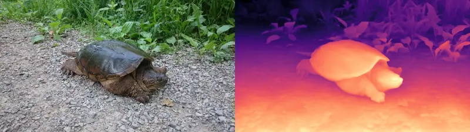

# Muggled DPT

This repo contains a simplified implementation of the very cool depth estimation model from [isl-org/MiDaS](https://github.com/isl-org/MiDaS), with the intention of [removing the magic](https://en.wikipedia.org/wiki/Muggle) from the original code. Most of the changes come from eliminating dependencies as well as adjusting the code to more directly represent the model architecture as described in the preprint: ["Vision Transformers for Dense Prediction"](https://arxiv.org/abs/2103.13413).

<p align="center">
  
</p>

While the focus of this implementation is on readability, there are also some performance improvements with MiDaS v3.1 models (40-60% on my GPU at least) due to caching of positional encodings, at the cost of higher VRAM usage (this can be disabled).

## Usage

The purpose of this repo is to provide an easy to follow code base to understand how the DPT & image encoder models are structured. The code of the [run_image.py](https://github.com/heyoeyo/muggled_dpt/blob/main/run_image.py) demo script is a good starting point if you'd like to better understand how to make use of the DPT models.

To understand the model structure, consider checking out the implementation of the [DPT module](https://github.com/heyoeyo/muggled_dpt/blob/main/lib/dpt_model.py), I'd recommended comparing this to the information in the [original preprint](https://arxiv.org/abs/2103.13413), particularly figure 1 in the paper.


## Getting started

This repo includes two demo scripts, [run_image.py](https://github.com/heyoeyo/muggled_dpt/blob/main/run_image.py) and [run_video.py](https://github.com/heyoeyo/muggled_dpt/blob/main/run_video.py). To use these scripts, you'll need to first have [Python](https://www.python.org/) (v3.6+) installed, then set up a virtual environment and install some additional requirements.


### Install
First create and activate a virtual environment (do this inside the repo folder after [cloning/downloading](https://docs.github.com/en/repositories/creating-and-managing-repositories/cloning-a-repository) it):
```bash
# For linux or mac:
python3 -m venv .env
source .env/bin/activate

# For windows (cmd):
python -m venv .env
.env\Scripts\activate.bat
```

Then install the requirements (or you could install them manually from the [requirements.txt](https://github.com/heyoeyo/muggled_dpt/blob/main/requirements.txt) file):
```bash
pip install -r requirements.txt
```

<details>
<summary>Additional Info</summary>

If you're using Windows and want to use an Nvidia GPU or if you're on Linux and don't have a GPU, you'll need to use a slightly different install command to make use of your hardware setup. You can use the [Pytorch installer guide](https://pytorch.org/get-started/locally/) to figure out the command to use. For example, for GPU use on Windows it may look something like:
```bash
pip3 uninstall torch  # <-- Do this first if you already installed from the requirements.txt file
pip3 install torch --index-url https://download.pytorch.org/whl/cu121
```

**Note**: With the Windows install as-is, you may get an error about a `missing c10.dll` dependency. Downloading and installing this [mysterious .exe file](https://aka.ms/vs/16/release/vc_redist.x64.exe) seems to fix the problem.

</details>

### Model Weights

Before you can run a model, you'll need to download it's weights.

This repo supports the [BEiT](https://arxiv.org/abs/2106.08254) and [SwinV2](https://arxiv.org/abs/2111.09883) models from [MiDaS v3.1](https://arxiv.org/abs/2307.14460) which can be downloaded from the [isl-org/MiDaS releases page](https://github.com/isl-org/MiDaS/releases/tag/v3_1). Additionally, [DINOv2](https://arxiv.org/abs/2304.07193) models are supported from [Depth-Anything](https://arxiv.org/abs/2401.10891), which can be downloaded from the [LiheYoung/Depth-Anything](https://huggingface.co/spaces/LiheYoung/Depth-Anything/tree/main/checkpoints) repo on Hugging Face.

After downloading a model file, you can place it in the `model_weights` folder of this repo or otherwise just keep note of the file path, since you'll need to provide this when running the demo scripts. If you do place the file in the [model_weights](https://github.com/heyoeyo/muggled_dpt/tree/main/model_weights) folder, then it will auto-load when running the scripts.

<details>

<summary>Direct download links</summary>

The table below includes direct download links to all of the supported models. **Note:** These are all links to _other_ repos, none of these files belong to MuggledDPT!

| Model | Size (MB) |
| -----| -----|
| [depth-anything-vit-small](https://huggingface.co/spaces/LiheYoung/Depth-Anything/resolve/main/checkpoints/depth_anything_vits14.pth?download=true) | 99 |
| [depth-anything-vit-base](https://huggingface.co/spaces/LiheYoung/Depth-Anything/resolve/main/checkpoints/depth_anything_vitb14.pth?download=true) | 390 |
| [depth-anything-vit-large](https://huggingface.co/spaces/LiheYoung/Depth-Anything/resolve/main/checkpoints/depth_anything_vitl14.pth?download=true) | 1340 |
| [swin2-tiny-256](https://github.com/isl-org/MiDaS/releases/download/v3_1/dpt_swin2_tiny_256.pt) | 164 |
| [swin2-base-384](https://github.com/isl-org/MiDaS/releases/download/v3_1/dpt_swin2_base_384.pt) | 416 |
| [swin2-large-384](https://github.com/isl-org/MiDaS/releases/download/v3_1/dpt_swin2_large_384.pt) | 840 |
| [beit-base-384](https://github.com/isl-org/MiDaS/releases/download/v3_1/dpt_beit_base_384.pt) | 456 |
| [beit-large-384](https://github.com/isl-org/MiDaS/releases/download/v3_1/dpt_beit_large_384.pt) | 1340 |
| [beit-large-512](https://github.com/isl-org/MiDaS/releases/download/v3_1/dpt_beit_large_512.pt) | 1470 |

</details>


## Run Image

<p align="center">
  
</p>

The `run_image.py` script will run the depth prediction model on a single image. To use the script, make sure you've activated the virtual environment (from the earlier install) and then, from the repo folder use:
```bash
python run_image.py
```
You can also add  `--help` to the end of this command to see a list of additional flags you can set when running this script.

If you don't provide an image path (using the `-i` flag), then you will be asked to provide one when you run the script, likewise for a path to the model weights. Afterwards, a window will pop-up, with various sliders that can be used to modify the depth visualization. These let you adjust the contrast of the depth visualization, as well as remove a plane-of-best-fit, which can often remove the 'floor' from the depth prediction. You can press `s` to save the current depth image.

## Run Video (or webcam)

<p align="center">
  
</p>

The `run_video.py` script will run the depth prediction model on individual frames from a video. To use the script, again make sure you're in the activated virtual environment and then from the repo folder use:
```bash
python run_video.py
```
As with the image script, you can add `--help` to the end of this command to see a list of additional modifiers flags you can set. For example, you can use a webcam as input using the flag `--use_webcam` 

You will be asked to provide a path to a video file & model weights, if you don't provide these through flags. Then, a window will pop-up with various sliders, similar to the image script. Additionally, there is a playback indicator which you can control (i.e. jump around the video) by clicking and dragging your mouse on any part of the displayed image.

The depth predictions are made _asynchrounously_, (i.e. only when the GPU is ready to do more processing). This leads to faster playback/interaction, but the depth results may appear choppy. You can force synchrounous playback using the `-sync` flag.

**Note:** The original DPT implementation is not designed for consistency across video frames, so the results can be very noisy looking. If you actually need video depth estimation, consider [Consistent Depth of Moving Objects in Video](https://dynamic-video-depth.github.io/) and the listed related works.


## Note on depth results

The DPT models output results which are related to the _multiplicative inverse_ (i.e. `1/d`) of the true depth! As a result, the closest part of an image will have the _largest_ reported value from the DPT model and the furthest part will have the _smallest_ reported value. Additionally, the reported values will not be distributed linearly, which will make the results look distorted if interpretted geometrically (e.g. as a 3D model).

If you happen to know what the _true_ minimum and maximum depth values are for a given image, you can compute the true depth from the DPT result using:

$$\text{True Depth} = \left [ V_{norm} \left ( \frac{1}{d_{min}} - \frac{1}{d_{max}} \right ) + \frac{1}{d_{max}} \right ] ^{-1}$$

Where d<sub>min</sub> and d<sub>max</sub> are the known minimum and maximum (respectively) true depth values and V<sub>norm</sub> is the DPT result normalized to be between 0 and 1 (a.k.a the normalized inverse depth).

For more information, please see the [results explainer](https://github.com/heyoeyo/muggled_dpt/blob/main/.readme_assets/results_explainer.md)


# Acknowledgements

The code in this repo is based on code from the following sources.

[isl-org/MiDaS](https://github.com/isl-org/MiDaS):
```bibtext
@article {Ranftl2022,
    author  = "Ren\'{e} Ranftl and Katrin Lasinger and David Hafner and Konrad Schindler and Vladlen Koltun",
    title   = "Towards Robust Monocular Depth Estimation: Mixing Datasets for Zero-Shot Cross-Dataset Transfer",
    journal = "IEEE Transactions on Pattern Analysis and Machine Intelligence",
    year    = "2022",
    volume  = "44",
    number  = "3"
}

@article{Ranftl2021,
	author    = {Ren\'{e} Ranftl and Alexey Bochkovskiy and Vladlen Koltun},
	title     = {Vision Transformers for Dense Prediction},
	journal   = {ICCV},
	year      = {2021},
}

@article{birkl2023midas,
      title={MiDaS v3.1 -- A Model Zoo for Robust Monocular Relative Depth Estimation},
      author={Reiner Birkl and Diana Wofk and Matthias M{\"u}ller},
      journal={arXiv preprint arXiv:2307.14460},
      year={2023}
}
```

[rwightman/pytorch-image-models](https://github.com/huggingface/pytorch-image-models/tree/v0.6.12) (aka timm, specifically v0.6.12):
```bibtex
@misc{rw2019timm,
  author = {Ross Wightman},
  title = {PyTorch Image Models},
  year = {2019},
  publisher = {GitHub},
  journal = {GitHub repository},
  doi = {10.5281/zenodo.4414861},
  howpublished = {\url{https://github.com/rwightman/pytorch-image-models}}
}
```

[LiheYoung/Depth-Anything](https://github.com/LiheYoung/Depth-Anything):
```bibtex
@article{depthanything,
      title={Depth Anything: Unleashing the Power of Large-Scale Unlabeled Data},
      author={Yang, Lihe and Kang, Bingyi and Huang, Zilong and Xu, Xiaogang and Feng, Jiashi and Zhao, Hengshuang},
      journal={arXiv:2401.10891},
      year={2024}
}
```

[facebookresearch/dinov2](https://github.com/facebookresearch/dinov2):
```bibtext
@misc{oquab2023dinov2,
  title={DINOv2: Learning Robust Visual Features without Supervision},
  author={Oquab, Maxime and Darcet, Timothée and Moutakanni, Theo and Vo, Huy V. and Szafraniec, Marc and Khalidov, Vasil and Fernandez, Pierre and Haziza, Daniel and Massa, Francisco and El-Nouby, Alaaeldin and Howes, Russell and Huang, Po-Yao and Xu, Hu and Sharma, Vasu and Li, Shang-Wen and Galuba, Wojciech and Rabbat, Mike and Assran, Mido and Ballas, Nicolas and Synnaeve, Gabriel and Misra, Ishan and Jegou, Herve and Mairal, Julien and Labatut, Patrick and Joulin, Armand and Bojanowski, Piotr},
  journal={arXiv:2304.07193},
  year={2023}
}
```

# TODOs
- Inevitable bugfixes
- Lots more documentation!