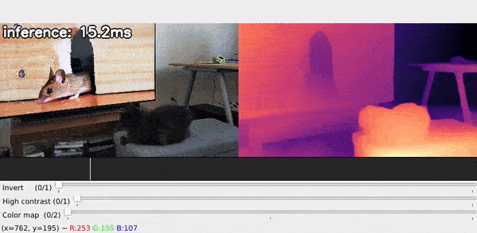

# Muggled DPT

This repo contains a simplified implementation of the very cool depth estimation model from [isl-org/MiDaS](https://github.com/isl-org/MiDaS), with the intention of [removing the magic](https://en.wikipedia.org/wiki/Muggle) from the original code. Most of the changes come from eliminating dependencies as well as adjusting the code to more directly represent the model architecture as described in the preprint: ["Vision Transformers for Dense Prediction"](https://arxiv.org/abs/2103.13413).

While the focus of this implementation is on readability, there are also some performance improvements (40-60% on my GPU at least) due to caching of positional encodings (at the cost of higher VRAM usage!).

<p align="center">
  
</p>

## Getting started

This repo includes two demo scripts, run_image.py and run_video.py. To use these scripts, you'll need to first have [Python](https://www.python.org/) (v3.6+) installed, then set up a virtual environment and install some additional requirements.

### Install
First create and activate a virtual environment (do this inside the repo folder after [cloning/downloading](https://docs.github.com/en/repositories/creating-and-managing-repositories/cloning-a-repository) it):
```bash
# For linux or mac:
python3 -m venv .env
source .env/bin/activate

# For windows (cmd):
python -m venv .env
.env\Scripts\activate.bat
```

Then install the requirements (or you could install them manually from the requirements.txt file):
```bash
pip install -r requirements.txt
```
Note that if you're using Windows and want to use an Nvidia GPU or if you're on Linux and don't have a GPU, you'll need to use a slightly different install command to make use of your hardware setup. You can use the [Pytorch installer guide](https://pytorch.org/get-started/locally/) to figure out the command to use. For example, for GPU use on Windows it may look something like:
```bash
pip3 install torch --index-url https://download.pytorch.org/whl/cu121
```

### Model Weights

Before you can run a model, you'll need to download it's weights. This isn't handled automagically by this repo, so you'll have to do it manually (we're trying to avoid the use of magic after all!).

This repo only supports [MiDaS v3.1](https://arxiv.org/abs/2307.14460) at the moment, and only [BEiT](https://arxiv.org/abs/2106.08254) models. You can download the model weights from the original [isl-org/MiDaS releases page](https://github.com/isl-org/MiDaS/releases/tag/v3_1). Specifically, the [BEiT-base-384](https://github.com/isl-org/MiDaS/releases/download/v3_1/dpt_beit_base_384.pt) is a good lightweight option, while [BEiT-large-512](https://github.com/isl-org/MiDaS/releases/download/v3_1/dpt_beit_large_512.pt) is a slower, more accurate model.

After downloading the models, you can place them in the `model_weights` folder of this repo or otherwise just keep note of the file path to the model, since you'll need to provide this when running the demo scripts. If you place the file in the `model_weights` folder, then the smallest model will auto-load when running the scripts! You can also reference the model by part of it's file name instead of providing the full path if it's located in the weights folder.

## Run Image

<p align="center">
  
</p>

The `run_image.py` script will run the depth prediction model on a single image. To use the script, make sure you've activated the virtual environment (from the earlier install) and then, from the repo folder use:
```bash
python run_image.py
```
You can also add  `--help` to the end of this command to see a list of additional flags you can set when running this script.

If you don't provide an image path (using the `-i` flag), then you will be asked to provide one when you run the script, likewise for a path to the model weights. Afterwards, a window will pop-up, with various sliders that can be used to modify the depth visualization. These let you adjust the contrast of the depth visualization, as well as remove a 'plane-of-best-fit', which can often remove the 'floor' from the depth prediction.

## Run Video (or webcam)

<p align="center">
  
</p>

The `run_video.py` script will run the depth prediction model on individual frames from a video. To use the script, again make sure you're in the activated virtual environment and then from the repo folder use:
```bash
python run_video.py
```
As with the image script, you can add `--help` to the end of this command to see a list of additional modifiers flags you can set. For example, you can use a webcam as input using the flag `--use_webcam` 

You will be asked to provide a path to a video file & model weights, if you don't provide these through flags. Then, a window will pop-up with various sliders, similar to the image script. Additionally, there is a playback indicator which you can control (i.e. jump around the video) by clicking and dragging your mouse on any part of the displayed image.

The depth predictions are made _asynchrounously_, (i.e. only when the device is ready to do more processing). This leads to smoother playback/interaction, but the depth results may appear choppy. You can adjust the display timing using the `--display_ms` flag, larger values will give slower playback but less choppy depth predictions. Note that the display time affects the reported inference speed, so if you want to get accurate timing numbers, set the value to `1`.

**Note:** The original DPT implementation is not designed for consistency across video frames, so the results can be very noisy looking. If you actually need video depth estimation, consider [Consistent Depth of Moving Objects in Video](https://dynamic-video-depth.github.io/) and the listed related works.


# TODOs
- Inevitable bugfixes
- Lots more documentation!
- Add support for swinv2 models
- Potentially add support for v3 DPT models