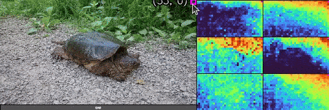
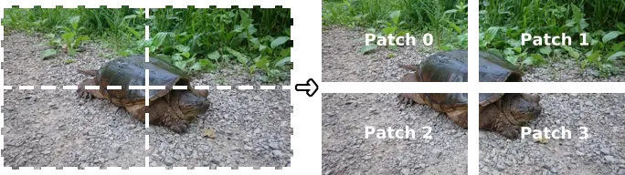
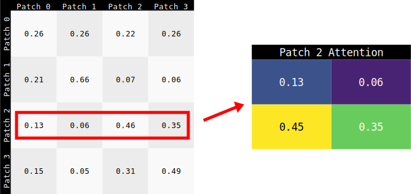
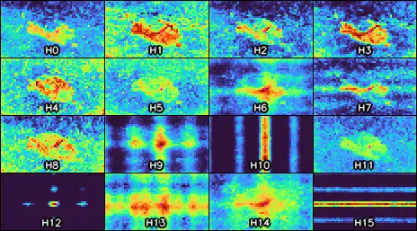
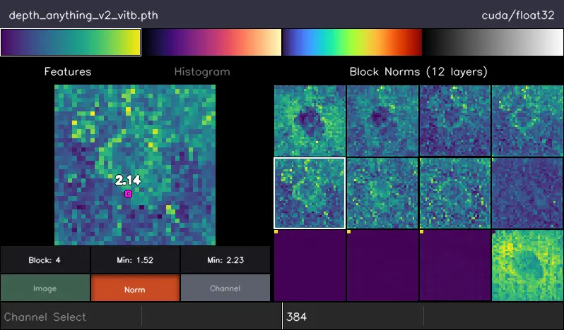
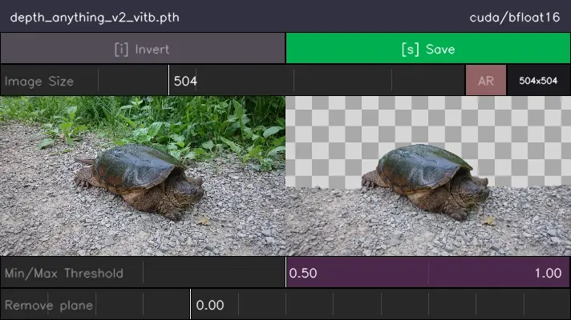
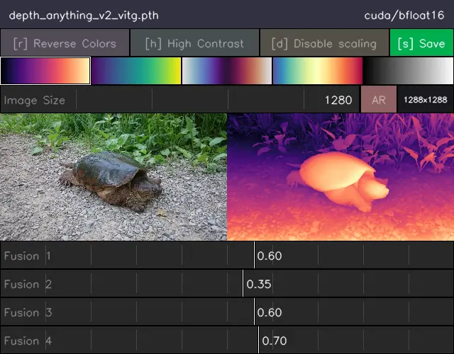
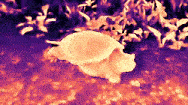

# Muggled DPT - Experiments

This folder contains random experiments using the DPT models, mostly out of curiosity. These scripts have configurable options which can be viewed by running the scripts with the `--help` flag.

## Attention Map Visualization

Vision transformers (like those used in DPT models) rely heavily on computing 'attention' (see "[Attention is all you need](https://arxiv.org/abs/1706.03762)" and "[An Image is Worth 16x16 Words](https://arxiv.org/abs/2010.11929)" for more info). The name _attention_ suggests that these maps somehow represent a model's internal sense of which parts of an input image are 'worth looking at'. This seems like a very abstract idea, so this script was made to help see what this data actually looks like.

  

The script takes in the position of your mouse cursor over top of the original image (see the left side of the example animation above) as a method to select an input [patch](https://github.com/heyoeyo/muggled_dpt/tree/main/lib#patch-embedding-model) of the image. From this patch selection, a visualization is created which corresponds to the attention associated with the selected patch (the right side of the animation above), for a given layer of the model.

### Explanation

The image below depicts an image with a 2x2 patch embedding for a total of only 4 patches to make it easier to interpret. In practice, models usually operate with dozens of patches along either edge (e.g. 30x30).

  

The attention calculation computes a comparison score between all pairs of patches. For N patches there will be a total of N2 comparisons (16 comparisons for 4 patches in this example) and this is represented in a two-dimensional NxN matrix. Each entry of the matrix can be thought of as answering the question: How relevant is this column (patch) to the row (patch)?

When performing this computation, the rows are normalized using a [softmax](https://pytorch.org/docs/stable/generated/torch.nn.Softmax.html) function so that the values along each row always add up to a total of 1.0. This leads to an interesting implication that the values along each row can be thought of as a probability distribution or weighting. And since every column corresponds to a different patch of the image, this probability distribution can be re-shaped back into a 2D image-like representation for display!

  

This means that within the attention matrix, each of the input patches of the image has it's own _entire image_ showing how it compares to all other patches, and this is what the attention visualization script shows. The mouse position selects a particular patch from the original image, this is used to pick the appropriate row from the attention matrix and that row is then converted back into a 2D image format and displayed beside the original image. For the sake of curiosity, this script also supports visualizing the _columns_ of the attention matrix. Though the result is harder to interpret (it isn't a probability distribution), it can give surprising results, especially when selecting outliers (e.g. high norm tokens).

It's important to note that vision transformers typically have multiple 'heads'. Each of the different 'heads' has it's own attention matrix that can be thought of as 'paying attention' to different features or qualities of the image. As a result, every patch has not one, but several attention images, one for each head! There are 6 heads (vit-small) for the animation above, and 16 (vit-large) for the example below.

  

There are a bewildering number of patterns that come out of these visualizations! One of the main takeaways however, is that the models do appear to 'look at' things that would be considered semantically meaningful to a human (e.g. entire objects, parts of objects, edges or even color groups). Surprisingly, they tend to pick up these patterns at very early layers.

## Block Norm Visualization

This script was made to visualize the [L2 norms](https://builtin.com/data-science/vector-norms) (i.e. lengths) of the tokens from internal transformer blocks of the DPT models. This is specifically due to the paper: "[Vision Transformers Need Registers](https://arxiv.org/abs/2309.16588)", which suggests that there are unusually high-norm 'patches' within vision transformers when they do not include additional global tokens (similar to a class token), called registers. None of the DPT models (so far) include these registers, and so we'd expect to see the high-norm tokens (which we do!).

  

Running this script generates an image showing a plot of the norms of the image patches (tokens) from each transformer block. The high-norm tokens are easily visible in multiple models, usually on the later internal blocks. The minimum and maximum norm values are also printed out for each block, showing norms often in the 100's (rule of thumb suggests they should be around 1).

## Depth Masking

This script was inspired by a question on the Depth-Anything V2 issues board ([issue #25](https://github.com/DepthAnything/Depth-Anything-V2/issues/25)) about using the depth prediction to mask out areas of an image, for example, to mask out 'the background' based on depth.

  

In the image above, 'far away' regions are masked out, which has the effect of removing much of the background behind the turtle. More generally, an upper and lower depth threshold can be specified and any part of the image with a predicted depth outside this range will be masked. The thresholding can also be inverted (i.e. parts of the image _within_ the range are masked out) and the resulting mask and mask image can be saved. Due to the fact that the [depth predictions are inverted](https://github.com/heyoeyo/muggled_dpt/blob/main/.readme_assets/results_explainer.md), the 'lower' threshold is used to exclude background elements and vice versa for the upper threshold.

Masking using depth will tend to be limited due to the presence of a ground plane or other gradually varying elements which have depth values spanning most of the scene. For example, in the image above, the turtle cannot be fully segmented because it shares some depth values with the ground. However, a plane-removal control has been included in the script to help mitigate these sorts of problems by subtracting the gradual ramping depth from the prediction. In practice, this approach to masking is still very limited, for more consistent/controllable masking, consider checking out [MuggledSAM](https://github.com/heyoeyo/muggled_sam)!

## Fusion Scaling

This script originally started as a test to see what would happen if some of the [4 fusion layers](https://github.com/heyoeyo/muggled_dpt/tree/main/lib#fusion-model) of the DPT model were disabled. Based on the DPT structure and the fact that the upper fusion layers are downscaled, it stands to reason that the upper layers should encode large scale patterns, while lower layers encode finer details. In practice something more complicated seems to be happening, and it varies (significantly) by model.

  

Rather than simply disabling fusion layers, this script allows for each layer to be individually scaled (potentially to 0, which disables the layer) while observing the depth result. Interestingly, some of the fusion layers seem to have a kind of 'blurring' effect on the output. Reducing the impact of these blurring layers can lead to results that have far greater details than the normal model output, though this does seem to come at the expense of the correctness of the depth mapping for larger-scale details. Be sure to try this with different image base sizing as well, for example  by running the script with the `-b` flag (e.g. `-b 1000`).

  

This script can also generate some wild looking [glitch art](https://en.wikipedia.org/wiki/Glitch_art) when using larger and/or negative scaling factors!

## Export Onnx

This script was made to help export DPT models into the [ONNX](https://onnx.ai/onnx/intro/concepts.html) format. These files fully contain the model execution instructions along with the model weights, which makes them simpler to deploy in applications. They can also be used outside of Python/Pytorch.

So far, the script seems to support Depth-Anything & BEiT DPT models and works across variable input image sizes. However, the SwinV2 models can only be exported for fixed-sized input images, as support for different image sizes relies on python control flow statements that do not seem to be compatible with the onnx exporter (it may be possible to fix this at some point). Also note that in order to run this script, you need to install onnx and (to also test the model works) onnxruntime. This can be done using pip:

`pip install onnx==1.15.* onnxruntime==1.17.*`

If you export an onnx model, you can view the onnx structure using tools like [netron](https://netron.app/).

> [!Note]
> This exporting script is mostly included as a way to verify compatibility with external formats (onnx in this case), and to figure out how exporting works. If you actually need onnx formatted depth models, I would recommend the [fabio-sim/Depth-Anything-ONNX](https://github.com/fabio-sim/Depth-Anything-ONNX) repo, which has onnx files directly available for download, and they also seem to include image pre-processing (e.g. scaling) support!