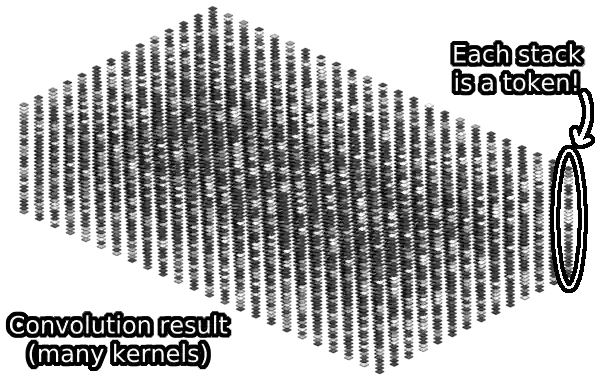
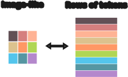
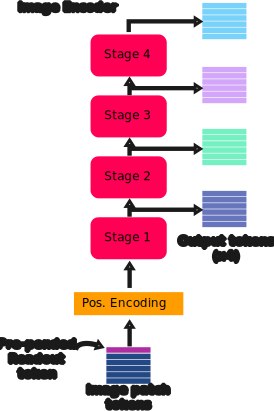
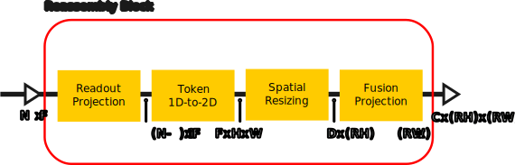
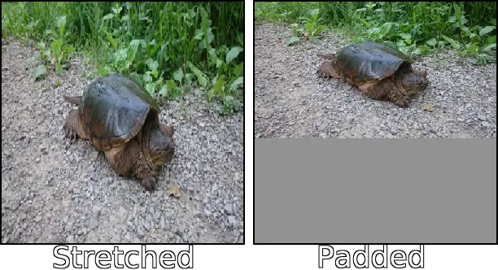

# Library scripts

The most important file in this folder is [dpt_model.py](https://github.com/heyoeyo/muggled_dpt/blob/main/lib/dpt_model.py) which is shared by all DPT implementations and is a direct code interpretation of the model architecture described in the original DPT paper: ["Vision Transformers for Dense Prediction"](https://arxiv.org/abs/2103.13413). 

The [make_dpt.py](https://github.com/heyoeyo/muggled_dpt/blob/main/lib/make_dpt.py) script is a helper used to build DPT models given model weights, without having to explicitly say which model variant you're trying to load. Each of the variants have their own dedicated 'make_{variant}_dpt' script which can be used to create models more directly: [make_beit_dpt.py](https://github.com/heyoeyo/muggled_dpt/blob/main/lib/make_beit_dpt.py), [make_swinv2_dpt.py](https://github.com/heyoeyo/muggled_dpt/blob/main/lib/make_swinv2_dpt.py) and [make_depthanything_dpt.py](https://github.com/heyoeyo/muggled_dpt/blob/main/lib/make_depthanything_dpt.py).

### Note on code structure

The code for each model variant is written in a standalone manner, so that the different implementations are almost entirely contained within their respective folders. Import statements are also written in a relative format, which means that the model folders can be copy-pasted into other projects if you'd like to experiment with them.

This goes against the convention of having [DRY](https://en.wikipedia.org/wiki/Don%27t_repeat_yourself) code so you'll find a lot of duplication across models. However, this results in code that has fewer _switches_ to toggle functionality on or off depending of the requirements of different models, and is overall easier to understand (imo).

## DPT Structure

All model variants share the same basic DPT structure, though there are some model-specific changes, often to accomodate differences in the image encoders. This section will describe the DPT structure mirroring the original implementation details. Individual model differences are documented in their respective folders.

  

The DPT model consists of 5 separate sub-models: a patch embedding model, image encoder, reassembly model, fusion model and monocular depth head model. Input images are passed sequentially through the components to generate [inverse-depth](https://github.com/heyoeyo/muggled_dpt/blob/main/.readme_assets/results_explainer.md) maps. Each of these components is described in detail below. 

---
### Patch Embedding Model

The patch embedding model is responsible for 'dicing up' the input image into tokens for the image encoder (transformer) model. More specifically, RGB images are split into 3-channel `16x16` patches, with no overlap. Each patch is linearly projected so that it becomes an `Fx1` vector (where `F` is the number of features per token of the transformer model), and each of the patches (now vectors, aka tokens) is grouped into a single `Np x F` tensor (where `Np` is the number of patches).

  

It's worth noting that the dicing and projection steps are very elegantly handled using a full-strided [convolution layer](https://pytorch.org/docs/stable/generated/torch.nn.Conv2d.html). Each step of the convolution takes one of the 16x16 RGB patches and converts it into a single number (via a [dot product](https://en.wikipedia.org/wiki/Dot_product)), so that a single convolution kernel applied to the whole image produces a grid of numbers matching the patch grid size. For example, for the 224x384 RGB image shown, one convolution kernel results in a 14x24 grid of numbers. Notice that this is a kind of 16x spatial downscaling. This factor of 16 is later restored by the fusion and head models!

  

This is repeated with `F` convolution kernels to create `F` grids of numbers. Each grid of numbers can be thought of as being stacked on top of one another. Each column or stack of numbers corresponds to a single _token_. Since each stack corresponds to one of the image patches, the number of tokens matches the patch sizing (for the example shown, the patch sizing is 14x24, so there are 14*24 = 336 tokens). The example below shows the number of features per token (`F`) as only 32, but this varies with model size and is in the 250-1000 range in practice.

  

There are two important data representations used throughout the DPT model (and vision transformers more generally). One is an 'image-like' format, as depicted in the images above. The other is a 'rows of tokens' format, where each of the tokens can be thought of as being a single entry in a long list containing all the tokens, which is more consistent with the original (text) transformer implementations. The final output from the patch embedding model uses the 'rows of tokens' format. The 'image-like' representation is converted to the 'rows of tokens' format using a [flatten](https://pytorch.org/docs/stable/generated/torch.flatten.html) operation. The result is a 2D tensor with shape: `Np x F` (where `Np` is the number of patches, `F` is the features per patch).

  

---
### Image Encoder Model

The image encoder model is responsible for 'making sense' of the input image. Alternatively, this model can be thought of as generating a more meaningful representation of the image data compared to the original RGB representation (RGB is optimized for driving displays, it isn't an efficient way to convey meaning about the contents of an image), at least for the purposes of depth estimation.

A vision transformer model is used as the image encoder for DPT. The original vision transformer was introduced in the paper ["An Image is Worth 16x16 Words"](https://arxiv.org/abs/2010.11929) though there are many variations on this architecture (this is the main difference between the [SwinV2](https://github.com/heyoeyo/muggled_dpt/tree/main/lib/v31_swinv2), [BEiT](https://github.com/heyoeyo/muggled_dpt/tree/main/lib/v31_beit) and [Depth-Anything](https://github.com/heyoeyo/muggled_dpt/tree/main/lib/v1_depthanything) models supported by this repo).

The image encoder takes in the image patch tokens from the patch embedding step and adds a 'readout' token before passing all the tokens through further processing steps. This added token (often called a 'cls' token) is meant to represent more global (i.e. not pixel/patch specific) information about the image. Following this, a set of positional encodings are added, which are needed in order to convey the spatial relationship between the different tokens.

  

Importantly for the DPT model, the image encoder outputs 4 sets of tokens, 3 of which come from intermediate results 'inside' the transformer, while the 4th set of tokens correspond with the final output of the model. These outputs can be thought of as coming from 4 _stages_ which operate sequentially. Each stage is itself a sequence of transformer _blocks_, where the number of blocks varies based on the model size. Each of the 4 stages outputs an `N x F` tensor, where `N = Np + 1` is the number of tokens (equal to the number of image patches plus one to account for the added readout token).

  

The transformer blocks themselves are composed of 3 different elements: a self-attention layer, a [multi-layer perceptron](https://en.wikipedia.org/wiki/Multilayer_perceptron) (MLP) and [layer-norms](https://pytorch.org/docs/stable/generated/torch.nn.LayerNorm.html) which are applied prior to each of the other layers. They also make use of _residual_ connections, which just means that original input tokens are added to the results of processing from the other layers. Typically, the output of a transformer block matches the size/shape of the input, which can make vision transformers simpler to work with and reason about, compared to other image processing models like [convolutional neural-networks](https://www.ibm.com/topics/convolutional-neural-networks). An example of a single transformer block is shown below (alternatively, see the 'Transformer Encoder' in figure 1 of ["An Image is Worth 16x16 Words"](https://arxiv.org/abs/2010.11929)), typical vision transformers have a dozen or (many) more of these blocks connected sequentially:

  

The self-attention layer is particularly unique to transformers. It originally comes from the paper ["Attention is all you need"](https://arxiv.org/abs/1706.03762) and can be represented mathematically as (see equation 1 of the attention paper):

$$\text{Attention}(Q, K, V) = \text{SoftMax} \left (\frac{QK^T}{\sqrt{d_{k}}} \right ) \times V$$

Where Q, K, V are linear transformations of the input tokens and are referred to as the 'queries', 'keys', and 'values'. The square root dk term in the denominator is meant to be the dimensionality of the queries and keys (typically this is equal to the number of features per token divided by the number of transformer 'heads'). For more information on the self-attention calculation and transformers in general, check out [The Illustrated Transformer](https://jalammar.github.io/illustrated-transformer/), by Jay Alamar (note that this is for text-based transformers, but the intuition holds if you think of image patches as tokens).

---
### Reassembly Model

The reassembly model is responsible for converting the 'rows of tokens' output from the transformer back into an image-like representation. The reassembly model creates 4 differently sized image-like representations from each of the 4 transformer outputs. The smallest output is half the width and height of the original input patch grid size, then there is an output matched to the original patch size, one which is 2 times larger and one which is 4 times larger. Each of the reassembly outputs is generated completely independently of one another. The smallest sized output comes from the 'top-most' set of tokens from the image encoder (i.e. the final output, also called stage 4 in these diagrams).

It's interesting to note that the design of this structure seems to assume a CNN-like [hierarchy of features](https://distill.pub/2017/feature-visualization/appendix/), where the earlier features of the model (the tokens from stage 1 of the transformer, in this case) contain high-frequency small-scale details requiring a higher spatial resolution to represent, while higher layers encode larger scale features at lower spatial resolutions.

  

The spatial up-/down-sampling is handled entirely through convolutions. In the case of up-sampling, strided [transpose-convolutions](https://pytorch.org/docs/stable/generated/torch.nn.ConvTranspose2d.html) are used, while strided (regular) convolutions are used for spatial down-sampling. The resizing layers also change the number of channels of the resulting 'image' internally, though the actual channel count varies by block (and model size) and seems to be somewhat hand-tuned.

Additionally, there is a convolution layer on the output of every reassembly block which is used to ensure all reassembly results have the same number of channels for use in the fusion model. This last convolution isn't documented in the research paper (as far as I can tell), but in the original code implementation these are referred to as [scratch.layer#_rn](https://github.com/isl-org/MiDaS/blob/bdc4ed64c095e026dc0a2f17cabb14d58263decb/midas/blocks.py#L149C5-L161C10) and are referred to as fusion projection layers in this repo.

The diagram below depicts a single reassembly block. There are 4 of these in total, one for each output of the image encoder stages. The shape of the tensors is indicated between each internal step to show how the reassembly blocks reshape their inputs. The sizing letters are as follows, `N`: number of tokens (including the readout token), `F`: the number of features per token (from the transformer), `D`: is an intermediate number of 'hidden' features used after resizing which varies by block, `HxW`: is the initial patch grid height and width (from the patch embedding step), `R`: is a resizing factor which varies by block (0.5x, 1x, 2x or 4x) and `C`: the shared output channel size.

  

Prior to re-constructing 2D image-like results, the reassembly model includes a [readout projection](https://github.com/heyoeyo/muggled_dpt/tree/main/lib/v31_beit/components) module. This step incorporates the readout (or 'cls') token information into the image patches, as the original authors found this improved the accuracy of the model results. Once the readout token is combined with the other image tokens, the resulting data has the same sizing as the output from the patch embedding. Therefore, the process of converting from the 1D tokens back into 2D image-like tensors is simply an [unflatten](https://pytorch.org/docs/stable/generated/torch.unflatten.html) operation, as this is the reverse of the [flatten](https://pytorch.org/docs/stable/generated/torch.flatten.html#torch.flatten) operation used by the patch embedding model to form the 1D tokens in the first place.

---
### Fusion Model

The fusion model is responsible for combining the 4 image-like outputs from the reassembly model back into a single image-like representation. It is constructured entirely out of convolution blocks, along with spatial upscaling (via [bilinear interpolation](https://en.wikipedia.org/wiki/Bilinear_interpolation)), which is needed to match together all of the differently sized outputs from the reassembly model. The fusion model makes heavy use of a component called a 'Residual Convolution Unit' which seems to be derived from the paper: ["RefineNet: Multi-Path Refinement Networks for High-Resolution Semantic Segmentation"](https://arxiv.org/abs/1611.06612), and is just two 3x3 convolutions with _pre_-[ReLu](https://en.wikipedia.org/wiki/Rectifier_(neural_networks)) activations (i.e. applied prior to each convolution) and a residual connection.

The final result of the fusion model is a single image-like tensor with the same number of channels as the input reassembly tensors, but with a width & height that is 8 times larger than the original image patch grid sizing.

  

#### Fusion blocks

The lower three fusion blocks take in two inputs: one from the output of the reassembly model and one input from the prior fusion blocks. The top-most fusion block doesn't have a prior fusion input.

  

Somewhat surprisingly, the top-most block only performs the computations which follow the original addition step, which means that the reassembly result is not pre-processed by a residual convolution block as with other fusion blocks.

---
### Monocular Depth Head Model

The head model is the final step in processing and has two responsibilities. First, it restores the height and width of the output to match the original input image. Second, the model converts the multi-channel result output from the fusion model into a single channel representing inverse-depth. The authors of the paper mention that the DPT model can be converted to perform semantic segmentation simply by swapping this head component!

The head model is fairly simple, it is entirely made out of convolution layers along with a (non-learned) spatial doubling via interpolation. The convolution steps are responsible for collasping the output down to a single channel. An explanation and diagram of both the depth estimation and semantic segmentation head models can be found in the appendix (page 12) of the [preprint paper](https://arxiv.org/abs/2103.13413). Only the depth head model is included in this repo. The diagram below shows the head model with the shape of the processed tensor indicated after each block. The letter sizing is as follows, `C`: represents the channel count of the output from the fusion model, `H` & `W`: is the initial patch grid height and width (from the patch embedding step).

  

Note that the sequence of convolutions within the head model have the effect of reducing the channel size by first halving it (from the original size output by the reassembly model), then reducing the channel count to 32 and then finally to a single channel at the output. The final output is the inverse-depth prediction!

It's also important to notice that the final output is 16x larger (than the original patch grid sizing) due to the spatial doubling of the head model and the 8x upscaling done by the fusion model. Since the initial patch embedding collapsed 16x16 patches of pixels, this 16x upscale effectively restores the original input image resolution!

## Image Pre-processing

In order for the DPT model to function properly, it must have correctly formatted input images. There are several important properties that input images must have in order to be processed by a DPT model:

1. The input must be a tensor
2. The pixel values of the image must be normalized to a certain mean and standard deviation, which varies by model (though typically around 0.0 and 1.0 respectively).
3. The image must have 3 channels in RGB order (note that opencv defaults to BGR order!)
4. The dimension ordering must be: batch, channels, height, width
5. The size of the image must be compatible with the model processing steps. More specifically, the image must have a width and height which are both some integer multiple of the patch size used by the patch embedding model. The exact multiple depends on the model variant.

Additionally, while not required, all DPT models have some 'base image size' that they target by default. Processing images at other sizes and aspect ratios is sometimes supported (all models in this repo have support for this), but they are expected to work best when the input image is scaled to match this base sizing.

In order to make sure all of these conditions are met, an 'image prep' class is used, which is also found in the [dpt_model.py](https://github.com/heyoeyo/muggled_dpt/blob/main/lib/dpt_model.py) script. Currently this class includes a single function for preparing images assuming the image is provided through opencv. The class also include many helper functions for post-processing the results, mostly to help with interpretability and display.

### Image padding

One important thing to note is that the image pre-processor in this repo **does not** pad images prior to processing by the DPT models. Instead, the image is stretched to fit to whatever size is specified. The other common approach is to scale the image so that the largest side fits inside a target processing resolution and then pad the shorter side to fill in any remaining space. The diagram below shows an example of the two approaches:

  

While stretching introduces distortion, padding introduces additional processing due to the empty space that gets added. Padding also (slightly) complicates the model processing as the extra space must be removed from the final output. This repo only supports stretching the input but also provides the option to process images at their original aspect ratio (or as near as possible) which arguably provides the best balance of efficient processing while introducing minimal distortion.
