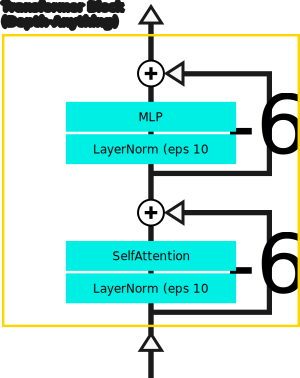
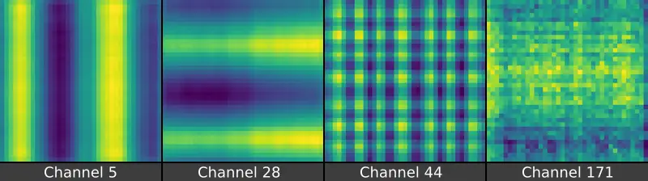

# v1 Depth-Anything Model Components

This folder contains smaller sub-components of the Depth-Anything DPT model. It also contains a folder of helper modules which are not specific to Depth-Anything, but are used throughout various model components.

## Transformer Block

The transformer block is the main component of the Depth-Anything image encoder model ([DINOv2](https://github.com/facebookresearch/dinov2)). It is effectively identical to the original vision transformer implementation.

  

The only difference between the Depth-Anything transformer block and the [standard block](https://github.com/heyoeyo/muggled_dpt/tree/main/lib#image-encoder-model) is a small change to the layernorms. Within Depth-Anything, layernorms use an epsilon value of 1e-6 instead of the [default](https://pytorch.org/docs/stable/generated/torch.nn.LayerNorm.html) 1e-5. However, this change does not seem to have a significant impact, at least during inference.

#### XFormers

The attention component of the transformer block can (optionally) make use of the [xFormers](https://github.com/facebookresearch/xformers) library if it is installed. This can have a substantial impact on performance, especially when using larger image sizes. Below is a comparison between running the largest Depth-Anything model (vit-large) with and without the use of xFormers. The table lists results in `xFormers enabled / disabled` ordering for various square input images sizes:

| Square Size (px) | VRAM (MiB) | Inference Time (ms) |
| :--------------: | :--------: | :-----------------: |
|              | (enabled / disabled) | (enabled / disabled) | 
| 252              | 1172 / 1172  | 10 / 11           |
| 392              | 1140 / 1140  | 19 / 22           |
| 504              | 1228 / 1264  | 34 / 41           |
| 756              | 1504 / 1600  | 72 / 112          |
| 1036             | 1980 / 2990  | 147 / 290         |
| 1428             | 2872 / 7904  | 330 / 840         |
| 1904             | 4348 / 22428 | 830 / 2800        |

The inference numbers are obtained from running a single test video (using the [run_video](https://github.com/heyoeyo/muggled_dpt/tree/main?tab=readme-ov-file#run-video-or-webcam) script) and reading off the reported inference time, while VRAM usage comes from [nvidia-smi](https://developer.nvidia.com/nvidia-system-management-interface). The results are not meant to be scientific, but just to give a sense of the impact of using xFormers.

As the table shows, at larger image sizes, VRAM usage with xFormers grows roughly linearly with input image size. Without xFormers, VRAM usage scales proportional to the image size raised to the power of 4 (i.e quadratically with pixel count). Similarly, the inference time is generally faster and scales better when using xFormers, especially at larger input sizes.

> [!Note]
> All results shown use float16. Using xFormers still improves memory usage with float32, but the inference speed seems to largely match the built-in pytorch implementation when using float32.

> [!Important]
>Use of xFormers has been removed as of April 2025. It's been replaced with the built-in [scaled-dot-product-attention](https://pytorch.org/docs/stable/generated/torch.nn.functional.scaled_dot_product_attention.html) operation in pytorch which provides a similar benefit without requiring additional dependencies. The documentation above is being left as-is, since it also applies to the built-in SDPA operation.

## Position Encoding

The position encoding of the Depth-Anything model is identical to the original vision transformer implementation, from "[An Image is Worth 16x16 Words](https://arxiv.org/abs/2010.11929)". The model uses learned positional encodings that are added to the patch embeddings at a single point, just before entering into the transformer model (unlike the [BEiT](https://github.com/heyoeyo/muggled_dpt/tree/main/lib/v31_beit/components#relative-position-encoder) or [SwinV2](https://github.com/heyoeyo/muggled_dpt/tree/main/lib/v31_swinv2/components#relative-position-encoder) which add an encoding at every layer!).

Since there is only a single set of position encodings for the entire model, it's fairly easy to access and visualize them. The image below shows various channels of the ViT-small model (there are 384 channels total for this model). Interestingly, many channels have obvious sinusoidal patterns. Curiously, similar 'high frequency' patterns tend to become visible when adjusting the [fusion layer scaling factors](https://github.com/heyoeyo/muggled_dpt/tree/main/experiments#fusion-scaling), particularly when using higher resolution inputs.

  

Since the position encodings are learned, they end up being a fixed size, and therefore only work for input images matching this size. In the case of Depth-Anything, the learned encodings have a width and height of 37x37, to match the expected size of the patch embeddings which assume a 518x518 pixel input image and use a 14 pixel patch size (518/14 = 37). To support other input image sizes, the position encodings are [interpolated](https://pytorch.org/docs/stable/generated/torch.nn.functional.interpolate.html) (in 2D) to match the size of the patch embedding.

In the original implementation, when processing images that are not 518x518, the positional encodings are interpolated to match the input sizing every time the model is run. In the implementation in this repo, caching is included so that the interpolated encodings can be reused when re-running frames of the same size. This can give a small (~10%) performance improvement when processing videos at sizes other than the base 518 pixel size.