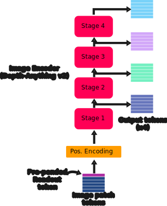

# v2 Depth-Anything

This folder contains the Depth-Anything V2 DPT model implementation, in correspondence with figure 1 from the preprint: ["Vision Transformers for Dense Prediction"](https://arxiv.org/abs/2103.13413), along with modifications specific to the Depth-Anything V2 implementation, from the paper: ["Depth Anything V2"](https://arxiv.org/abs/2406.09414). This model uses DINOv2 from ["DINOv2: Learning Robust Visual Features without Supervision"](https://arxiv.org/abs/2304.07193) as it's image encoder.

For a more compreshensive description of the DPT model components, please see the existing documentation describing the original [DPT implementation](https://github.com/heyoeyo/muggled_dpt/tree/main/lib). The focus here is on describing the details which are unique to the Depth-Anything V2 models.

## Differences from Original DPT / Depth-Anything V1

The V2 models are almost entirely identical to the V1 models, except for the output structuring of the image encoder (described in more detail below). The main difference between the models is actually related to how the V2 models were trained, which involved high resolution synthetic data, with the goal being to create a model that does a better job handling fine details.

### Patch Embedding Model

As with the V1 models, the V2 models use a patch size of 14 pixels, which deviates from the original 16 pixel sizing of the DPT models. The smaller patch sizing leads to differences in how the final 'depth head' model is implemented. However the patch embedding is otherwise structurally identical to the original DPT model.

### Image Encoder Model

Just like the V1 models, the V2 models use the [DINOv2](https://arxiv.org/abs/2304.07193) image encoder ([without registers](https://arxiv.org/abs/2309.16588)). This image encoder is much simpler (and seemingly more effective) than what is found in other DPT models. However, unlike the V1 implementation, the V2 image encoder outputs 4 sets of tokens from _evenly spaced_ intermediate layers of the transformer (i.e. one from each of the 4 stages). This is more inline with other DPT models and should mean that less of the total encoding information is contained in just the last-most output of the model (as was the case with the V1 implementation):

  

It's not clear if this structural change is actually beneficial, however it does produce dramatically different results when visualizing the effects of [fusion scaling](https://github.com/heyoeyo/muggled_dpt/tree/main/experiments#fusion-scaling).

### Reassembly Model

The V2 implementation of the reassembly model exactly matches the V1 implementation, including the fact that the model processes but then ignores the 'readout' token (a.k.a. cls token) of the image encoder. In the original [MiDaS preprint](https://arxiv.org/abs/2103.13413), this was shown (see table 7 of the paper) to have a near negligible impact on the model output.

### Fusion Model

Again the V2 implementation of the fusion model exactly matches the V1 version. Notably the Depth-Anything V2 model, in this repo, limits input images to sizes that produce evenly-sized patch embeddings (e.g. 36x36 or 38x38) as opposed to the original model implementation which used an odd sizing (37x37) by default. This is done in order to simplify the fusion model implementation, which can assume that each of the reassembly inputs (which are downscaled by factors of 2) can be upscaled by factors of 2 to exactly restore their original sizing. For more information, please see the [depth-anything V1](https://github.com/heyoeyo/muggled_dpt/tree/main/lib/v1_depthanything) model description.

### Monocular Depth Head Model

As with the V1 implementation, the V2 depth head model is structurally identical to the original DPT implementation, but features a final upscaling factor of only 1.75, rather than the original factor of 2. This is a consequence of the 14 pixel patch sizing used in the patch embedding model, compared to the (original) 16 pixel size. Please see the [depth-anything V1](https://github.com/heyoeyo/muggled_dpt/tree/main/lib/v1_depthanything) documentation which describes this in more detail.

#### Metric Depth

This repo does not intend to support metric depth models as they normally use a structure which is different from the original DPT implementation. However, a surprising detail of the V2 depth models is that the metric depth implementation re-uses the _relative_ depth (i.e DPT) model, except for a very small difference: the last-most layer of the depth head uses a [sigmoid](https://github.com/DepthAnything/Depth-Anything-V2/blob/31dc97708961675ce6b3a8d8ffa729170a4aa273/metric_depth/depth_anything_v2/dpt.py#L113) activation instead of [relu](https://github.com/DepthAnything/Depth-Anything-V2/blob/31dc97708961675ce6b3a8d8ffa729170a4aa273/depth_anything_v2/dpt.py#L113). This is a significant departure from other metric depth models (including the V1 Depth-Anything models), which have historically used architectures based on the [ZoeDepth](https://arxiv.org/abs/2302.12288) model.

  

The diagram above shows the difference between the relative and metric Depth-Anything V2 depth heads. The activation functions are shown (unlike in the more general [DPT diagram](https://github.com/heyoeyo/muggled_dpt/tree/main/lib#monocular-depth-head-model)) to help indicate that the metric depth model differs only in the final layer, which uses [Sigmoid](https://pytorch.org/docs/stable/generated/torch.nn.Sigmoid.html) instead of [ReLU](https://pytorch.org/docs/stable/generated/torch.nn.ReLU.html). For the original implementation of the metric depth models, there is an additional fixed scaling term ([max_depth](https://github.com/DepthAnything/Depth-Anything-V2/blob/31dc97708961675ce6b3a8d8ffa729170a4aa273/metric_depth/depth_anything_v2/dpt.py#L183)) applied to the output of the depth head model in order to scale the sigmoid results to values greater than 1. This repo supports swapping in the metric version of the depth head, but only if the loaded model file contains the word `metric`, as there is no way to determine if a model is a metric variant from the weights alone (since they exactly match the relative depth models!), however the fixed  scaling term is not included in this implementation.

While the re-use of the relative depth model is convenient, the use of a sigmoid layer combined with a fixed scaling term seems to limit the practical usefulness of the V2 metric depth models. For example, the models now require the user to know, in advance, what the maximum depth in a scene might be in order to get proper scaling. Arguably this also implies that the model doesn't really learn to predict _metric_ depth, but instead a _normalized_ (but not inverted) depth.