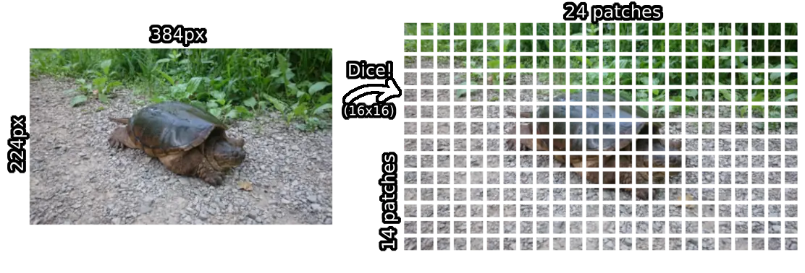
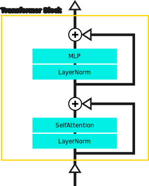
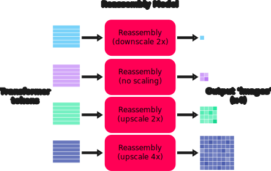
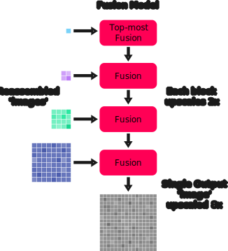
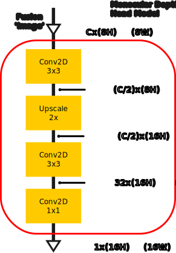

# v3.1 BEiT

This folder contains the major pieces of the BEiT DPT model, in correspondence with figure 1 from the preprint: ["Vision Transformers for Dense Prediction"](https://arxiv.org/abs/2103.13413). Input images are passed sequentially through each of the components described below to generate inverse-depth maps.

  

## Patch Embedding Model

The patch embedding model is responsible for 'dicing up' the input image into tokens for the image encoder (transformer) model. More specifically, RGB images are split into 3-channel `16x16` patches, with no overlap. Each patch is linearly projected so that it becomes an `Fx1` vector (where `F` is the number of features per token of the transformer model), and each of the patches (now vectors, aka tokens) is grouped into a single `Np x F` tensor (where `Np` is the number of patches).

  

It's worth noting that the dicing and projection steps are very elegantly handled using a full-strided [convolution layer](https://pytorch.org/docs/stable/generated/torch.nn.Conv2d.html). Each step of the convolution takes one of the 16x16 RGB patches and converts it into a single number (via a [dot product](https://en.wikipedia.org/wiki/Dot_product)), so that a single convolution kernel applied to the whole image produces a grid of numbers matching the patch grid size. For example, for the 224x384 RGB image shown, one convolution kernel results in a 14x24 grid of numbers. Notice that this is effectively a special kind of 16x spatial downscaling. This factor of 16 is later restored by the fusion and head models!

  

This is repeated with `F` convolution kernels to create `F` grids of numbers. Each grid of numbers can be thought of as being stacked on top of one another. Each column or stack of numbers corresponds to a single _token_. Since each stack corresponds to one of the image patches, the number of tokens matches the patch sizing (for the example shown, the patch sizing is 14x24, so there are 14*24 = 336 tokens). The example below shows the number of features per token (`F`) as only 32, but this varies with model size and is in the 500-1000 range in practice.

  

Note that the final output from the patch embedding model is a 2D tensor with shape: `Np x F`, so that each of the tokens (stacks of numbers from the diagram above) is stored in rows. This is done using a [flatten](https://pytorch.org/docs/stable/generated/torch.flatten.html) operation.

## Image Encoder Model

The image encoder model is responsible for 'making sense' of the input image. Alternatively, this model can be thought of as generating a more meaningful representation of the image data compared to the original RGB representation (RGB is optimized for driving displays, it isn't an efficient way to convey meaning about the contents of the image), at least for the purposes of depth estimation. The image encoder takes in the image patch tokens from the patch embedding step and adds a 'readout' token before passing all the tokens through further processing steps.

The encoder model is based on the [BEiT](https://arxiv.org/abs/2106.08254) image transformer model, which actually seems to be a method to train an image transformer model, rather than an architecture. The BEiT architecture is seemingly a typical vision transformer (i.e. like ViT), and doesn't use any kind of windowing. However it does make use of [relative positional encodings](https://github.com/heyoeyo/muggled_dpt/tree/main/lib/v31_beit/components) which are added to the attention matrix at every transformer block, which greatly complicates it's implementation. Importantly for the DPT model, the image encoder outputs 4 sets of tokens, 3 of which come from intermediate results 'inside' the transformer, while the 4th set of tokens correspond with the final transformer block output. These outputs can be thought of as coming from 4 _stages_ which operate sequentially. Each stage is itself a sequence of transformer _blocks_, where the number of blocks varies based on the model size. Each of the 4 stages outputs an `NxF` tensor, where `N = Np + 1` is the number of tokens (equal to the number of image patches plus one to account for the added readout token).

  

The transformer blocks themselves are mostly typical (again, with the exception of the relative positional encoding), exactly following the ViT pattern of calculating self-attention followed by an MLP layer, with [layernorms](https://pytorch.org/docs/stable/generated/torch.nn.LayerNorm.html) applied prior to both the attention and MLP calculations (see the 'Transformer Encoder' in figure 1 of ["An Image is Worth 16x16 Words"](https://arxiv.org/abs/2010.11929)).

  

 Note that due to the relative positional encoding, the attention calculation within each transformer block is modified compared to the original ["Attention is all you need"](https://arxiv.org/abs/1706.03762) implementation, as follows:

$$Attention(Q, K, V) = SoftMax(\frac{QK^T}{\sqrt{d}} + B)V$$
$$\text{(where B is the positional encoding 'bias' term)}$$

## Reassembly Model

The reassembly model is responsible for converting the tokens output from the transformer back into an image-like representation. The reassembly model creates 4 differently sized image-like representations from each of the 4 transformer outputs. The smallest output is half the width and height of the original input patch grid size, then there is an output matched to the original patch size, one which is 2 times larger and one which is 4 times larger. Each of the reassembly outputs is generated completely independently of one another.

It's interesting to note that the design of this structure seems to assume a CNN-like [hierarchy of features](https://distill.pub/2017/feature-visualization/appendix/), where the earlier features of the model (the tokens from stage 1 of the transformer, in this case) contain high-frequency small-scale details requiring a higher spatial resolution to represent, while higher layers encode larger scale features at lower spatial resolutions.

  

The spatial up-/down-sampling is handled entirely through convolutions. In the case of up-sampling, strided [transpose-convolutions](https://pytorch.org/docs/stable/generated/torch.nn.ConvTranspose2d.html) are used, while strided (regular) convolutions are used for spatial down-sampling. The resizing layers also change the number of channels of the resulting 'image', though this varies by block (and model size) and does not follow a simple pattern.

Additionally, there is a convolution layer on the output of every reassembly block which is used to ensure all reassembly results have the same number of channels for use in the fusion model. This last convolution isn't documented in the research paper (as far as I can tell), but in the original code implementation these are referred to as [scratch.layer#_rn](https://github.com/isl-org/MiDaS/blob/bdc4ed64c095e026dc0a2f17cabb14d58263decb/midas/blocks.py#L149C5-L161C10) and are referred to as fusion projection layers in this repo.

The diagram below depicts a single reassembly block. The shape of the tensors is indicated between each block to show how the reassembly blocks reshape their inputs. The sizing letters are as follows, `N`: number of tokens (including the readout token), `F`: the number of features per token (from the transformer), `D`: is an intermediate number of 'hidden' features used after resizing which varies by block, `HxW`: is the patch grid height and width (from the patch embedding step), `R`: is the resizing factor which varies by block (0.5x, 1x, 2x or 4x) and `C`: the shared output channel size.

  

Prior to re-constructing 2D image-like results, the reassembly model includes a [readout projection](https://github.com/heyoeyo/muggled_dpt/tree/main/lib/v31_beit/components) module. This step incorporates the readout (or 'cls') token information into the image patches, as the original authors found this improved the accuracy of the model results. Once the readout token is combined with the other image tokens, the resulting data has the same sizing as the output from the patch embedding. Therefore, the process of converting from the 1D tokens back into 2D image-like tensors is simply an [unflatten](https://pytorch.org/docs/stable/generated/torch.unflatten.html) operation, as this is the reverse of the [flatten](https://pytorch.org/docs/stable/generated/torch.flatten.html#torch.flatten) operation used by the patch embedding model to form the 1D tokens in the first place.

## Fusion Model

The fusion model is responsible for combining the 4 image-like outputs from the reassembly model back into a single image-like representation. It is constructured entirely out of convolution blocks, along with spatial upscaling (via [bilinear interpolation](https://en.wikipedia.org/wiki/Bilinear_interpolation)), which is needed to match together all of the differently sized outputs from the reassembly model. The fusion model makes heavy use of a component called a 'Residual Convolution Unit' which is itself derived from the paper: ["RefineNet: Multi-Path Refinement Networks for High-Resolution Semantic Segmentation"](https://arxiv.org/abs/1611.06612), and is just two 3x3 convolutions with _pre_-ReLu activations (i.e. applied prior to each convolution) and a residual connection.

The final result of the fusion model is a single image-like tensor with the same number of channels as the input reassembly tensors, but with a width & height that is 8 times larger than the original image patch grid sizing.

  

### Fusion blocks
The lower three fusion blocks take in two inputs: one from the output of the reassembly model and one input from the prior fusion blocks. The top-most fusion block doesn't have a prior fusion input.

  

Somewhat surprisingly, the top-most block only performs the computations which follow the original addition step, which means that the reassembly result is not pre-processed by a residual convolution block as with other fusion blocks.

## Monocular Depth Head Model

The head model is the final step in processing and is mainly responsible for generating the actual inverse-depth output data from the encoded result output by the fusion model. It also doubles both the width and height of the result in the process. The authors of the paper mention that the model can be converted to perform semantic segmentation by simply swapping the head!

The head model is fairly simple, it is entirely made out of convolution layers along with a (non-learned) spatial doubling via interpolation. The convolution steps have the effect of converting the final result to have only a single channel, representing inverse-depth. An explanation and diagram of both the depth estimation and semantic segmentation head models can be found in the appendix (page 12) of the [preprint paper](https://arxiv.org/abs/2103.13413). Only the depth head model is included in this repo. The diagram below shows the head model with the shape of the processed tensor indicated after each block. The letter sizing is as follows, `C`: represents the shared channel count of the outputs from the reassembly model (and the fusion model output), `H` & `W`: is the patch grid height and width (from the patch embedding step).

  

Note that the sequence of convolutions within the head model have the effect of reducing the channel size by first halving it (from the original size output by the reassembly model), then reducing the channel count to 32 and then finally to a single channel at the output. The final output is the inverse-depth prediction!

It's also important to notice that the final output is 16x larger (than the original patch grid sizing) due to all of the upscaling done by the fusion and head model. Since the patch embedding collapsed 16x16 patches of pixels, this 16x upscale effectively restores the original input image resolution!