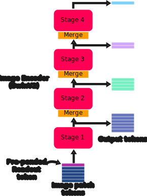
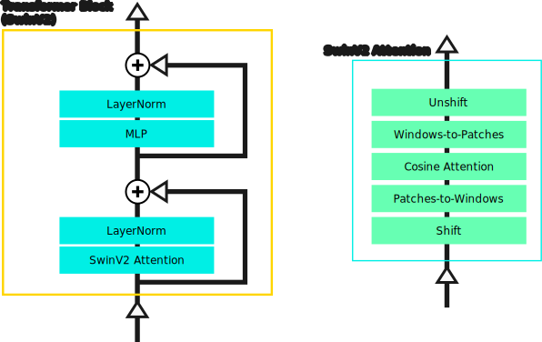
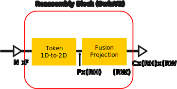

# v3.1 SwinV2

This folder contains the major pieces of the SwinV2 DPT model, in correspondence with figure 1 from the preprint: ["Vision Transformers for Dense Prediction"](https://arxiv.org/abs/2103.13413), along with Swin-specific modifications described in the follow-up paper: ["MiDaS v3.1 -- A Model Zoo for Robust Monocular Relative Depth Estimation"](https://arxiv.org/abs/2307.14460).

The SwinV2 model, described in "[Swin Transformer V2: Scaling Up Capacity and Resolution](https://arxiv.org/abs/2111.09883)" is as the name suggests, a modification of the earlier Swin (V1) model introduced in "[Swin Transformer: Hierarchical Vision Transformer using Shifted Windows](https://arxiv.org/abs/2103.14030)". The earlier paper is especially helpful for understanding the major structural components of the model. Among the DPT models, the Swin image encoder is certainly the most complex, though this complexity brings improvements in speed (for similar output accuracy) compared to the simpler BEiT model, for example.

For a more compreshensive description of the DPT model components, please see the existing documentation describing the original [DPT implementation](https://github.com/heyoeyo/muggled_dpt/tree/main/lib). The focus here is on describing the details which are unique to the SwinV2 models.

## Differences from Original DPT

### Patch Embedding Model

The patch embedding for SwinV2 is notably different from the original MiDaS implementation, in that the patch size is a mere 4px! It also includes a post-patch [LayerNorm](https://pytorch.org/docs/stable/generated/torch.nn.LayerNorm.html). While the patch sizing seems surprisingly small, these patches undergo 4 patch merging steps, each of which quarters the number of patches (while also doubling the number of features per patch), so that the model is not dealing with an unmanagable number of patches. The model also makes extensive use of windowed attention, which further reduces the amount of computation required.

For more details on the merging and windowing functionality, check out the [SwinV2 components](https://github.com/heyoeyo/muggled_dpt/tree/main/lib/v31_swinv2/components).

### Image Encoder Model

The image encoder of the SwinV2 model is heavily modified compared to the original ViT implementation. These modifications help to reduce memory usage as well as improving model execution times, however they do come at the cost of added complexity. The SwinV2 model was initially built as a 4-stage transformer, conveniently matching the requirements of the original DPT implementation. However, the output of each of these stages changes size due to a novel patch merging step which occurs between stages. The merging steps have the effect of reducing the height and width of the image-like representation by a factor of two at the start of each stage (except the first), though the outputs are still in a rows-of-tokens format.

  

Additionally, the transformer block structure is modified to work on windows (i.e. subsets of the tokens) and can include a shifting step. The shifting/unshifting steps only occur on every-other transformer block (i.e. 'odd' indexed blocks, 1, 3, 5, etc.).

  

There are more SwinV2-specific modifications within the attention blocks themselves. For one, unlike the original ViT, SwinV2 adds a [relative positional encoding](https://github.com/heyoeyo/muggled_dpt/tree/main/lib/v31_swinv2/components#relative-position-encoder) to the Q-K attention matrix, as if it were a bias term, on every attention block.

$$\text{Attention}(Q, K, V) = \text{SoftMax} \left (\frac{1}{\tau}\text{cosine}(Q, K) + B \right )V$$

$$\text{(where B can be thought of as a positional encoding 'bias' term)}$$

The attention calculation itself differs and is referred to as 'scaled cosine attention' which can be thought of as computing the cosine of the angle between the query and key tokens, and this is then scaled by a learned parameter. And finally, the SwinV2 transformer blocks re-arrange the ordering of the layernorm steps so they are computed _after_ the attention and MLP steps, as this is said to prevent attention amplitudes from growing throughout the model.

### Reassembly Model

The reassembly model of the Swin-based DPT model is substantially different from the original MiDaS description. For one, the SwinV2 model does not include a readout (or cls) token, and therefore doesn't need to perform the readout-projection step described in the original MiDaS paper. Additionally, since the Swin image encoder already outputs a set of tokens which are spatially scaled (by factors of 2) relative to one another, the reassembly model no longer needs to include a resizing step! This makes the model extremely simple to understand and implement.

Each reassembly block (there are 4) simply reshapes each of the image encoder outputs from a 'rows-of-tokens' to image-like format and then follows this with a single 3x3 convolution layer. That's it!

  

It's worth noting that the outputs of the reassembly model all have the same number of channels `C` (due to the convolution step). As far as spatial sizing, the lowest output (e.g. earliest output from the image encoder) matches the size of the original patch grid (e.g. after patch embedding, using a 4px patch size), each output after this has it's spatial dimensions halved, so that the top-most output (e.g. last output from the image encoder) has a width and height that are both 8 times smaller than the original patch grid sizing.