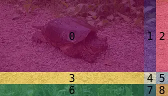

# v3.1 SwinV2 Model Components

This folder contains smaller sub-components of the SwinV2 DPT model. It also contains a folder of helper modules which are not specific to SwinV2, but are used throughout various model components.

## Patch Merging

Patch merging is an idea introduced in the [SwinV1 paper](https://arxiv.org/abs/2103.14030). Merging occurs prior to the input of each of the image encoder stages, except for the very first, and has the effect of reducing the number of tokens processed by later stages of the model. This process also leads to the Swin model having a hierarchical output, where the outputs at different stages can be thought of as representing different levels of detail (fine vs. coarse) from the original input image.

Merging works somewhat unusually. First, the image patches are grouped into separate 2x2 tiles (so 4 patches each), tiling the whole image. For each of these 2x2 groups there is a top-left, top-right, bottom-left and bottom-right patch. In the image below, within each of the 2x2 tiles, the patches are shown with different colors. Note that each patch would have many channels, which are not shown:

  

From this tiling, a repeating pattern appears. Every even-row, even-column is a 'top-left' patch (red). Every even-row, odd-column is a 'top-right' patch (yellow) and so on. The idea of patch merging is to combine these patch patterns into their own 4 smaller 'images'. Notice that due to this construction, each of these 4 images is exactly half the height and width of the original image. These 4 images are then stacked on top of each other, forming a single new image, now with 4 times as many channels as the original input had.

  

Finally, a linear layer is applied along the channel dimension (i.e. affecting each patch independently) to reduce the channel count by a factor of 2, though this halving occurs _after_ stacking, which itself quadrupled the channel count. The net effect is that number of tokens (patches) is reduced by a factor of 4 while doubling the number of features per token, compared to the input.

## Shifted-Windowed Attention

The idea of **s**hifted **win**dowing is the namesake of swin, though these are two separate ideas: shifting _and_ windowing.

### Windowing

Windowing refers to performing self-attention on a smaller subset of tokens, instead of all tokens together as is normally the case. In 'normal' (non-windowed) attention, every token is compared to every other token and this leads to a [quadratic scaling](https://en.wikipedia.org/wiki/Time_complexity#Table_of_common_time_complexities) of computation. Using smaller subsets (windowing) of tokens reduces the number of comparisons needed. Though this also reduces the information exchange among the tokens, which may affect output accuracy. The diagram below shows the attention pattern for a single token, where each gray square represents a single token. The left shows attention with normal attention (every token 'attends' to every other token) and the right shows the pattern with windowed attention (every token 'attends' to every token within it's own window). For clarity only a single attention pattern is shown, but these patterns are repeated between all possible token pairs!

  

It's important to understand that all tokens still undergo some sort of attention computation with windowing, it's just that each token interacts with a smaller group of other tokens. This helps reduce the impact of the quadratic scaling. For example, if there are 100 tokens, then regular attention requires each of the 100 tokens to 'attend' to the other 100 tokens, for a total of 1002 (= 10000) comparisons. However, if the 100 tokens are split into 25 groups (windows) of 4 tokens each, then each group only requires 42 (= 16) comparisons and this needs to be repeated for each of the 25 groups, for a total of 25*16 (= 400) total comparisons, a dramatic reduction!

### Shifting

The problem with windowing is that is prevents exchange of information outside of the different windows. One straightforward improvement would be to re-draw the window boundaries differently every time attention is computed, however the original swin authors considered this to be overly complicated and/or slow to implement. Instead, they use _cyclic shifting_ as a way to share information among different windows as information passes through the model.

  

The idea is very simple, instead of moving the window boundaries, the data itself is moved prior to performing the attention calculation! More specifically, the data is 'moved' by shifting (or sliding) the values around on the original grid points. Data at the edges of the image are wrapped around (this is the 'cyclic' part of the term), so that patches on the far left of the image wrap around to the far right, for example. Shifting is also easy to implement as it directly corresponds to the [roll](https://pytorch.org/docs/stable/generated/torch.roll.html) operation within Pytorch.

After shifting the image data, windowing proceeds as normal, but now different areas of the image are compared against each other. After the attention computation, the shift is reversed. The authors chose to shift by half the window sizing, which maximizes the number of tokens that 'change' within each window as a result of shifting. The shifting operation is performed on every other block in the original swin implementation (so that normal windowing and shifted-windowing alternate throughout the transformer).

### Masking

The use of cyclic shifting means that some image patches are wrapped around to opposite sides of the image. These wrap-around patches end up adjacent to patches that would typically be unrelated as they come from opposite sides of the image. The original authors considered it problematic to be performing the attention computation involving these wrap-around patches, so they introduce a mask to block out the wrap-around patches in their respective windows when computing attention.

  

Computing this mask is surprisingly complicated, since it has to match the shape of the attention tensor. It works by first generating a mask 'image' in the shape of the patch grid, and marking each of the major areas affected by shifting/windowing with a unique number. This image is then split into windows (in the diagrams below, different colors correspond to different unique numbers in the mask):

  

  

Each of these windows is then flattened into a 1D array of the patch numbers, resulting in the familiar 'rows of tokens' format. The final step is to build a 2D matrix matching the attention matrix sizing, which is formed by comparing each patch number to every other patch number in a single (flattened) window. Pairs of that have the same patch number can be included in the attention calculation, since they correspond to a shared region of the input image. Pairs that have non-matching numbers get masked out.

  

In the diagram above, one of the flattened windows is layed out horizontally (at the top) and vertically (on the left), then each row/column tile is colored so that the bottom-left half of the tile is colored by it's row color and the other half by it's column color. Black boxes have been drawn to help indicate whenever the row and column color match. These matching tiles correspond to parts of the attention matrix that should be used, since regions that have matching colors mean that they belong to the same part of the image. All other entries in the matrix should be masked out.

Due to the initial construction of the tiles, using unique numbers (here shown as colors) for each image region, the matching tiles can be found by subtracting the row values (colors) from the column values (colors) and marking any results that are zero (i.e. equal row and column values). Any non-zero entries correspond to regions that should be excluded from the attention calculation, which is done by replacing the entry with a large negative value, so that the entry is 'knocked out' when performing the softmax calculation following masking.

## Relative Position Encoder

The purpose of the relative position encoder is to provide information about the location of each image patch with respect to other image patches. The SwinV2 image encoder uses _relative_ position encodings which are added to the attention matrix at every layer (see equation 1 from the [SwinV2 paper](https://arxiv.org/abs/2111.09883)):

$$ \text{Attention}(Q, K, V) = \text{SoftMax}(Q{K}^T / \sqrt{d} + B)V $$

Where B represents the position encoding 'bias' term that is added. This closely resembles the use of position encoding in the [BEiT](https://arxiv.org/abs/2111.09883) model. However, unlike the BEiT model, the SwinV2 bias term is generated by a small, 2 layer [MLP](https://en.wikipedia.org/wiki/Multilayer_perceptron) model! More specifically, the model takes in the relative x- and y-offsets (Δx, Δy) between tokens in the attention matrix and computes a bias value (see equation 4 from the paper):

$$B = \text{MLP}(\hat{\Delta x}, \hat{\Delta y})$$
$$\hat{\Delta x} = \text{sign}(\Delta x) \times \text{log}(1 + |\Delta x|)$$
$$\hat{\Delta y} = \text{sign}(\Delta y) \times \text{log}(1 + |\Delta y|)$$

Note that the offsets (Δx, Δy) are log-scaled before being passed through the MLP model. The authors suggest that the use of log-scaling helps to compress the range of the offset values when transferring to larger image sizes, and they show that this can improve the performance of the model (see table 1 in the paper).

### Storage & Representation

When computing the attention bias values as described above, there tends to be many repeated offset pairs (Δx, Δy), which means that the bias values themselves are repeated throughout the bias matrix. To avoid storing and/or re-computing these repeated values, the SwinV2 model only computes each unique bias value once and stores the result in a look-up table. A special indexing matrix is then used to select the appropriate bias values for each entry of the bias matrix (matching the size of the attention matrix). This is a fairly elaborate way of handling the position encodings, but it helps to reduce VRAM and computational requirements.

This approach to handling position encodings is very similar to the BEiT model, except that there is no need for handling the readout (or 'cls') token, since the SwinV2 model does not include this extra token. For more details on how the look-up table and indexing matrix are constructed, please see the documentation describing the [BEiT position encodings](https://github.com/heyoeyo/muggled_dpt/tree/main/lib/v31_beit/components#relative-position-encoder).

### Spatial resizing

When running the SwinV2 model on larger (or smaller) image sizes than the original pretrained size, the position encodings need to be adjusted to match the change in the sizing of the attention matrix. In the BEiT model (and somewhat similarly in the Depth-Anything model), the position encodings are spatially up-/down-sampled to fit to the appropriate input size. With SwinV2, the position encoding table is simply re-generated at a different size, and passed through the bias MLP model.

In many ways, this is simpler and more elegant than the spatial interpolation approach used by other models, but it does mean that entirely 'new' (in the sense the model hasn't seen these values during training) relative position offsets can be generated when rebuilding the encoding table!

### Caching

The original SwinV2 implementation fully re-computes the MLP mapping of the position bias every time the model is run, as well as redoing the indexing step to generate the full attention matrix. Given that these values will not change for a fixed input image sizing, these repeated computations have a negative impact on the inference speed of the model. This repo adds the ability to cache the position encodings, which leads to a ~30-40% speed up, at the expense of more VRAM usage.

### Undocumented adjustments

The code for the SwinV2 position encoding includes a few undocumented scaling steps which are listed here for the sake of completeness.

#### Log-scaling of position offsets

While the original paper describes a log-scaling of the relative position offsets (see equation 4 in the paper, which is also written in the section above), the [actual code implementation](https://github.com/huggingface/pytorch-image-models/blob/ce4d3485b690837ba4e1cb4e0e6c4ed415e36cea/timm/models/swin_transformer_v2.py#L166C9-L174C67) is as follows:

$$\hat{\Delta x} = \text{sign}(\Delta x) \times \text{log}_2 \left (1 + \left | \frac{8 \Delta x}{p_x} \right | \right ) \times \frac{1}{\text{log}_2(8)}$$
$$\hat{\Delta y} = \text{sign}(\Delta y) \times \text{log}_2 \left (1 + \left | \frac{8 \Delta y}{p_y} \right | \right ) \times \frac{1}{\text{log}_2(8)}$$

Notably, the calculation uses log-base-2 and there are additional scaling factors of 8, px and py. The 'p' factors correspond to scaling by a window sizing, either the 'pretraining window size' or the current model window size. These scaling factors may be related to the discussion of extrapolating to larger window sizes described in section 3.3 of the [SwinV2 paper](https://arxiv.org/abs/2111.09883).

#### Clamped cosine scaling

One of the major differences between SwinV2 and the original SwinV1 is the use of 'scaled cosine attention'. This is described in equation 2 of the SwinV2 paper:

$$\text{Sim}(q_i, k_i) = \text{cos}(q_i, k_i) / \tau + B_{ij}$$

Where qi and ki are the query and key tokens (respectively), Bij is the positional encoding 'bias' and τ is a learned scaling factor. There are two notable differences tn the [actual code](https://github.com/huggingface/pytorch-image-models/blob/ce4d3485b690837ba4e1cb4e0e6c4ed415e36cea/timm/models/swin_transformer_v2.py#L221). For one, the scaling factor is applied multiplicatively, rather than as a divisor as suggested by the equation. Secondly, the scaling factor is clamped to a maximum value of loge(100) and then exponentiated.

The end result is that the scaling factor will always be a (multiplicative) value between 0 and +100.

#### Scaled sigmoid of bias values

Surprisingly, the bias values undergo a [substantial modification](https://github.com/huggingface/pytorch-image-models/blob/ce4d3485b690837ba4e1cb4e0e6c4ed415e36cea/timm/models/swin_transformer_v2.py#L228C9-L228C76) just before being added to the attention matrix. Specifically, the values are passed through a [sigmoid function](https://en.wikipedia.org/wiki/Sigmoid_function) and then scaled by a factor of 16. This changes the equation for the bias calculation to something like:

$$B = \frac{16}{1 + \text{exp} \left ( - \text{MLP}(\hat{\Delta x}, \hat{\Delta y}) \right )}$$

This should guarantee that all bias values lie between 0 and +16, though this does not seem to be documented in the original paper!
