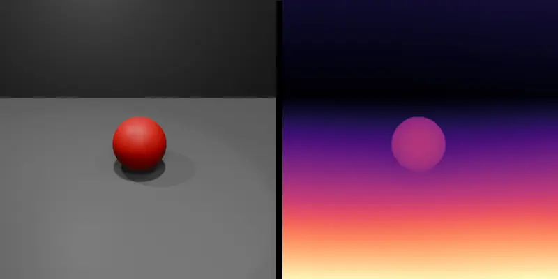
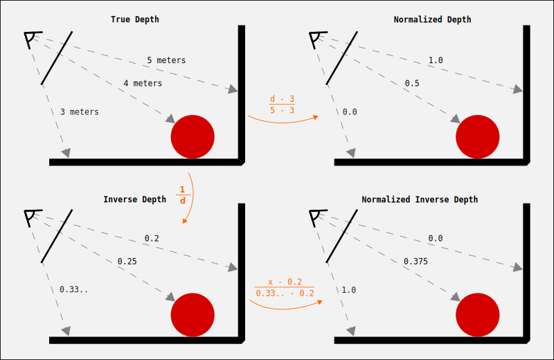
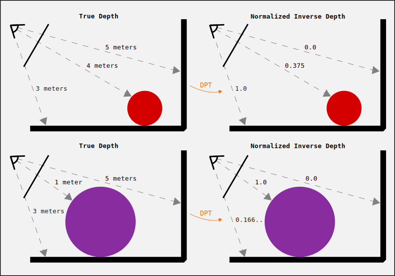

# DPT Depth Results

The DPT models output _inverse depth_ maps with (generally unknown) scaling and shift parameters. While this may seem strange, the justification is that it allows models to be trained on a wider variety of datasets which may otherwise have incompatible depth representations. The original explanation can be found in ["Towards Robust Monocular Depth Estimation"](https://arxiv.org/abs/1907.01341), under section 5: **Training on Diverse data**.

## Understanding Depth Representations

Consider the following image of a red ball with a floor/wall behind it, shown below along with the corresponding DPT colormapped result.

  

To help explain the difference between true depth, normalized depth, inverse depth and normalized inverse depth, we'll use an even more simplified 2D representation of the scene above.
In the image below, the top-left diagram shows the 'true depth' interpretation of the scene, where the eye/camera represents our viewing point and the distance to the closest (floor) and farthest (wall) points as well as the distance to the ball are shown. We assume that the farthest distance we see in the image is 5 meters away (a point on the wall) and the closest is 3 meters (a point on the floor), though these are just convenient made up numbers.

  

Notice that the value ordering of these points is reversed in the normalized inverse depth result (bottom-right), and corresponds to the DPT result. For example close parts of the image are shown in bright orange which correspond to values of 1.0 while far parts of the image are dark purple and correspond to values of 0.0. This is the idea behind 'inverse depth' which represents far points with smaller values.

Note: In practice, the DPT models seem to output an un-normalized inverse depth, but it is not scaled correctly to match the inverse of the true depth. Therefore, it seems to always make sense to normalize the DPT result both for display and calculations.

## True depth from DPT Result
Typically, we would want to go from the DPT result back to true depth. In the diagram above, we have formulas converting from true depth to inverse depth and then to normalized inverse depth. We can reverse the process to derive a formula that maps the normalized inverse result (DPT) back to true depth, assuming we know the minimum and maximum depth values (in this case 3 and 5 meters, respectively):

$$\text{True Depth} = \left [ V_{norm} \left ( \frac{1}{d_{min}} - \frac{1}{d_{max}} \right ) + \frac{1}{d_{max}} \right ] ^{-1}$$

Here Vnorm corresponds to the normalized inverse depth result (which we get by normalizing the DPT result) and dmin and dmax correspond to the (known) minimum and maximum depth values (in this case, 3 and 5). For example, we know the inverse depth of the ball is 0.375 and we expect this formula to give us the true depth of 4 meters:

$$\text{True Depth (ball)} = \left [ 0.375 \left ( \frac{1}{3} - \frac{1}{5} \right ) + \frac{1}{5} \right ] ^{-1} = \left [ 0.25 \right ] ^{-1} = 4$$

So that works as expected! But what about if you don't know the minimum and maximum (or any) true depth values? In that case, you're probably best off using something like [ZoeDepth](https://github.com/isl-org/ZoeDepth), which is an [extension on top of the DPT models](https://arxiv.org/abs/2302.12288) to handle metric depth (i.e. true depth).

However, if you don't care about getting exactly correct results and just want to 'un-distort' the inverse mapping, the formula above can be written as:

$$\text{True Depth} = \frac{1}{A \times V_{norm} + B}$$

With this form you can manually adjusted the A and B values until the mapping looks plausible.

## Results are scene-specific!

It's important to note that the mapping between the DPT result and the true depth varies on a scene-by-scene (or image-by-image) basis! It is not fixed for a given camera and (in general) will not be stable over a video sequence. This can be seen by the fact that the mapping depends on the closest and farthest objects in the image, due to the dmin and dmax terms. Consider the example below, where we start with the same red ball scene as before, but then replace the small red ball with a larger (and closer) purple ball:

  

In particular, notice that the purple ball is now mapped to the closest normalized inverse value (i.e. 1.0). If we used the same minimum and maximum depth values as before, we would incorrectly estimate the ball to be 3 meters away, since that was the previous value of dmin. In general, you can only reliably re-use the mapping if you know that the closest and farthest points are not changing between images.

## Infinite Depths

Images can contain sections which could be considered infinitely far away or otherwise ambiguous, for example the sky, which doesn't have a distinct location. These sections tend to get mapped to normalized inverse values of zero. This presents a problem when handling the inverse mapping, because dmax would need to be infinity and then the resulting equation maps zero values to infinity. While this sort of looks correct mathematically, it's a problem for representing the data on a computer!

A simple-ish fix for these cases would be to re-normalize the DPT result so that it is zero at a point with a known non-infinite depth (and still equal to 1 at the closest known point) and then use the formula described above with the now zeroed point interpretted as the maximum depth. This should produce non-infinite true depth estimates for the sky (or other ambiguous segments).